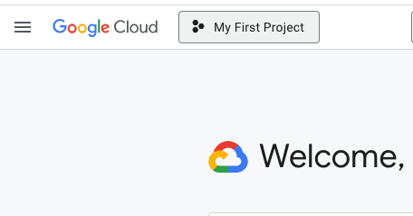

# 1.1.1 - Introduction to Google Cloud Platform

Youtube Video | \~3min




Another option is Github Codespace - but I have not used this option yet so my notes may not cover or help with questions or issues



:exclamation:Don't panic - you likely do not have any data in your cloud yet.&#x20;


:hammer\_pick: My Google Cloud Platform says 'Google Cloud' and no longer includes 'Platform'

:bookmark: Find your [GCP Google Cloud link](https://cloud.google.com/) and create your free account. It will ask for a credit card, but it will not charge you, it will actually give you a $300 dollar credit after your 90 day trial. See the Zoomcamp Slack for more FAQ.

### Create A New Project

<figure><figcaption></figcaption></figure>

1. Go to your GCP Google Cloud link and after you create your account you can create your first project. On the upper left hand side of your home screen, click _<mark style="background-color:green;">**'My First Project'**</mark>_.
2. This will open a window that will show your current projects & allow you to create a new one. Select _<mark style="background-color:green;">**'New project'**</mark>_ in the upper right hand side of this opened window.

<figure><figcaption></figcaption></figure>

3. This will again open another window. Fill in _<mark style="background-color:yellow;">**'Project name'**</mark>_ with '_taxi-rides-ny'_ or whatever you want and keep _<mark style="background-color:yellow;">**'Location'**</mark>_ as 'No Organization'. Then click _<mark style="background-color:green;">**'Create'**</mark>_

:white\_check\_mark: And now you have created your first GCP Google cloud platform project!

