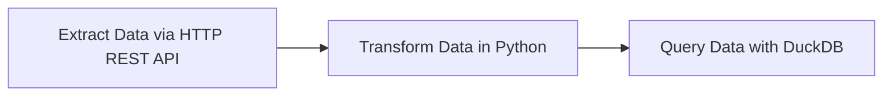

# 2.2.3 - Transform Data with dbt and Postgres in Kestra

Youtube Video | \~



...

Add notes from [https://github.com/Tinker0425/data-engineering-zoomcamp/tree/main/02-workflow-orchestration#local-db-load-taxi-data-to-postgres](https://github.com/Tinker0425/data-engineering-zoomcamp/tree/main/02-workflow-orchestration#local-db-load-taxi-data-to-postgres)

...

