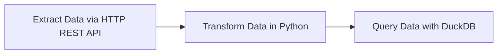

# 2.2.3 - Transform Data with dbt and Postgres in Kestra

Youtube Video | \~5 min




:eyes: We will go into more detail about dbt in week 4


<figure><figcaption></figcaption></figure>

host issue in the code...

github.com/DataTalksClub/data-engineering-zoomcamp/pull/628

...ok trying ANOTHER docker-compose yaml...ugh

... did not work, going back to main docker...

...going back to Brunos and trying - docker network inspect zoomcamp-network

network is video\_3\_default

...idk nothing is working here...

Add notes from [https://github.com/Tinker0425/data-engineering-zoomcamp/tree/main/02-workflow-orchestration#local-db-load-taxi-data-to-postgres](https://github.com/Tinker0425/data-engineering-zoomcamp/tree/main/02-workflow-orchestration#local-db-load-taxi-data-to-postgres)

...

